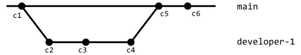

# PJP PEC 1

En esta PEC vamos a aprender a manejar GitHub y el entorno de programación que utilizaremos en el resto de PECs de la asignatura.

## Competencias

En esta PEC se desarrollan las siguientes competencias del Máster:

- [CB10] Que los estudiantes posean las habilidades de aprendizaje que les permitan continuar estudiando de una manera que tendrá que ser en gran medida autodirigida o autónoma.
- [CG1] Analizar y sintetizar información técnica compleja.
- [CE3] Utilizar de manera adecuada los lenguajes de programación y las mejores herramientas de desarrollo para el análisis, el diseño y la implementación de lugares y aplicaciones web en función de las necesidades del proyecto.
- [CE8] Adaptarse a las tecnologías web y a los futuros entornos actualizando las competencias profesionales.

## Objetivos

Los objetivos de esta PEC son:

- Configurar un entorno de trabajo para el desarrollo de aplicaciones en JavaScript.
- Conocer y saber utilizar los comandos básicos de Git.
- Conocer y saber utilizar GitHub y las principales tareas colaborativas de la plataforma.
- Revisar el nivel previo de programación.
- Poner en práctica conocimientos básicos de JavaScript.

## Entrega de la PEC

Una vez hayas realizado las actividades prácticas propuestas en este enunciado, **la entrega se realizará de forma doble**:

- Deberás enviar tus cambios al apartado del aula virtual de la UOC.
- Deberás enviar tus cambios al repositorio de GitHub Classroom.

Recuerda que este repositorio lo has clonado del repositorio en GitHub. Cuando trabajes en tu sistema, todos los cambios los harás en tus ficheros locales, los cuales tendrás que añadir y _comitear_ a tu repositorio Git. Estos cambios estarán en tu sistema hasta que hagas _push_ y los envíes al repositorio en GitHub.

Recuerda que debes trabajar en la rama _main_ o _master_ (la que se cree por defecto). Puedes hacer varios envíos.

En el aula virtual encontrarás una _checklist_ que te ayudará a repasar todos los pasos que debes hacer para la entrega de tu PEC.

## Puntuación

El hecho de trabajar con tests para verificar la funcionalidad del código os permitirá tener una idea de vuestra propia nota antes de la entrega. 

La puntuación de los ejercicios prácticos se basa en dos criterios: **Funcionalidad** e **implementación**. Se espera que los ejercicios funcionen correctamente (pasen los tests) y que la implementación (el código) tenga una calidad adecuada. 

Algunos detalles a tener en cuenta:

- Se penalizará cualquier intento de _hardcodear_ los tests para forzar que pasen. Esta técnica consiste en cambiar la implementación para que devuelva únicamente el valor esperado por el test (cualquier otro test fallaría).
- Los tests automáticos están diseñados para detectar ejercicios erróneos o incompletos para casos concretos. El hecho de que un test pase no garantiza que el ejercicio esté realizado correctamente, es decir, que cubra todos los casos.
- Un ejercicio cuyos tests no pasan se puntuará con un 0 salvo que existan problemas con el test.
- Además de pasar los tests, el profesorado evaluará vuestro código en base a los siguientes criterios:
  - Legibilidad, sencillez y calidad del código.
  - Conocimientos de programación. Por ejemplo, no utilizar las estructuras de control adecuadas, como utilizar un bucle para construir una sentencia condicional o viceversa.

## Requisitos mínimos

- Tener instalado Visual Studio Code (o cualquier otro IDE).
- Conocimientos básicos de Git y GitHub (Actividades 2 y 3 del Reto 1).
- Conocimientos básicos de programación (Requisito de la asignatura).

## Preguntas Teóricas (7 puntos)

Deberás responder a estas preguntas en el fichero `src/pec1/pec1.md`

### Ejercicio T1 (3 puntos)

La siguiente imagen muestra un escenario de desarrollo colaborativo en GitHub:


En parte central puedes ver el repositorio en GitHub, el cual contiene los ficheros indicados en la caja. 
A la izquierda y a la derecha del repositorio en GitHub, se han representado dos desarrolladores, denominados `Dev1` y `Dev2`, respectivamente. 
Cada desarrollador ha clonado el repositorio de GitHub y ha editado el fichero indicado en negrita. 
En la parte inferior de cada caja que representa a cada desarrollador, se indican los comandos de Git que ha ejecutado cada desarrollador para enviar sus cambios al repositorio en GitHub.

Responde y razona las siguientes preguntas (máximo 300 palabras):
* T1.1 (1,5 puntos) Describe cada uno de los comandos que ha realizado el desarrollador `Dev1` y valora si son correctos/incorrectos o necesarios/innecesario.
* T1.2 (1,5 puntos) Describe cada uno de los comandos que ha realizado el desarrollador `Dev2` y valora si son correctos/incorrectos o necesarios/innecesario.

### Ejercicio T2 (4 puntos)

La siguiente figura muestra un escenario de la evolución de un repositorio siguiendo la notación utilizada en los materiales de la asignatura:



Cada una de las líneas horizontales representa una rama en el repositorio. Como puede observarse, existen dos ramas:

* `main`, que es la rama principal del repositorio.
* `developer-1`, donde está trabajando uno de los desarrolladores de la aplicación. 

Cada círculo representa un `commit` en el repositorio. Los commits se han numerado según su momento temporal de creación. Además, su posición horizontal en cada una de las ramas ayuda a visualizar el momento temporal en el que se han creado. De esta manera, el commit `c2` se ha creado antes que el commit `c3`, de esta manera el círculo que representa `c2` está más a la izquierda que el círculo que representa `c3`. 

Responde y razona las siguientes preguntas (máximo 300 palabras):
* T2.1 (2 puntos) ¿Qué commits están considerados en la rama `developer-1`? 
* T2.2 (2 puntos) Una vez que se hace el _merge_ de la rama `developer-1` en la rama `main` y se crea el commit `c5`, ¿qué cambios se incorporan a la rama `main`? (debes indicar qué commits contribuyen a realizar cambios en la rama `main`).

## Ejercicios prácticos (3 puntos)

Para realizar los ejercicios prácticos debes dirigirte al fichero `src/pec1/pec1.js`

En este fichero deberás definir las funciones que te indicamos en los ejercicios que verás más abajo.

Por otro lado, los tests que te permitirán saber si la solución que propones para los ejercicios es correcta están en el fichero `src/pec/pec1.spec.js`.
**No debes editar este fichero**.
Ten en cuenta que los tests son condiciones que deben cumplir las funciones que implementarás en los ejercicios, por lo que pueden servirte de ayuda para corregirlos.

### Preparando el entorno (0 puntos)

En primer lugar, asegúrate de que tienes instalados:

- [Node.js](https://nodejs.org/es/)
- [VSCode](https://code.visualstudio.com/)
- [Git](https://git-scm.com/)

Para que vuestro profesor os localice en GitHub Classroom, recuerda que necesita conocer vuestro _login_ en la plataforma. Una vez estéis registrados en GitHub, podéis informar de vuestro _login_ tal y como se describe en la actividad 4.2 del Reto 1. 

A continuación te damos algunas indicaciones para preparar tu repositorio para la realización de los ejercicios.

#### Instala las dependencias del proyecto

```
npm install
```

Recuerda que es necesario estar situado en la carpeta raíz del proyecto.

#### Ejecuta los tests

```
npm t
```

La instrucción anterior lanzará los tests cada vez que guardes el fichero `src/pec1/pec1.js`, que es precisamente donde implementarás los ejercicios de esta PEC.

Como puedes esperar, la primera vez que ejecutes `npm t` y se lancen los tests, fallarán todos, ya que no hay ningún ejercicio implementado. Revisa el mensaje de error que se imprime para conocer su formato y entender cómo se notifican los errores.

Este es un ejemplo de una posible salida de error:

```
 FAIL  src/pec1/pec1.spec.js
  ex1:
    × should return true when value is between 2000 and 2020 (4 ms)
```

Es importante fijarse en la descripción del error, por ejemplo, el texto de error anterior indica que para el ejercicio 1 (`ex1`) la función debe devolver `true` si `value` está entre 2000 y 2020. Esta indicación os ayuda a revisar el código para comprobar porqué el comportamiento no es el esperado.

Una vez corregido el problema, en cuanto se guarda el fichero donde estamos editando los ejercicios, el test se vuelve a lanzar y nos mostraría:

```
 PASS  src/pec1/pec1.spec.js
  ex1
    √ should return true when value is between 2000 and 2020 (4 ms)
```

Ahora el test muestra `PASS` y el caso de prueba que antes fallaba se muestra como correcto (con el carácter `√`).

El entorno de pruebas tiene un menú (accesible mediante la tecla `w`) que os permite ejecutar los tests selectivamente. Por ejemplo, pulsando `a` podéis relanzar manualmente todos los tests; y pulsando `f` podéis relanzar solamente aquellos tests que han fallado. Probad las diferentes opciones y si tenéis alguna duda, consultadla en el foro de la asignatura.

### Ejercicio P1 (1,5 puntos)

Implementa una función `ex1` que determine si un valor numérico, que representa el año de producción de una película, está comprendido en el intervalo [2000, 2020].

La función recibirá el siguiente parámetro:
* `value`: Es un valor numérico.

La función devolverá `true` si el valor está comprendido entre los valores 2000 y 2020, ambos incluidos; y `false` en otro caso.

### Ejercicio P2 (1,5 puntos)

Implementa una función `ex2` que calcule la temperatura a partir del canto de un grillo. La temperatura se puede calcular dividiendo por 5 el número de veces que un grillo canta un 1 minuto y restando 9. 

La función recibirá los siguiente parámetros:
* `times`: Es el número de veces que un grillo canta en un minuto.

La función deberá devolver un valor número resultado de aplicar la fórmula descrita anteriormente.